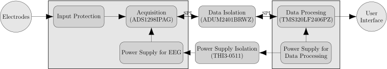

# Electroencephalograph

**This project is unfinished.**

## Summary

Encephalograph is a noninvasive and relatively simple device to monitor brain activity. The device measure frequency of electric currents generated in various areas of brain. Those waves corresponds to activity of those brain areas.

This project is based on a single chip that integrates all EEG acquisition, this simplifies the design and reduce costs.

## System architecture

## Hardware

Hardware was done using KiCAD.

## Software

Software part is to be determinated.

# Hazards

* **Electrodes of the device are directly connected to human head, therefore high attention needs to be put on safety of the device.** The risk of electric shock was limited by using data/power isolation and inserting extra resistors and diode clamps in frontend of the device. **The device is a personal project and was not tested to any safety norms e.g. IEC 60601.**
